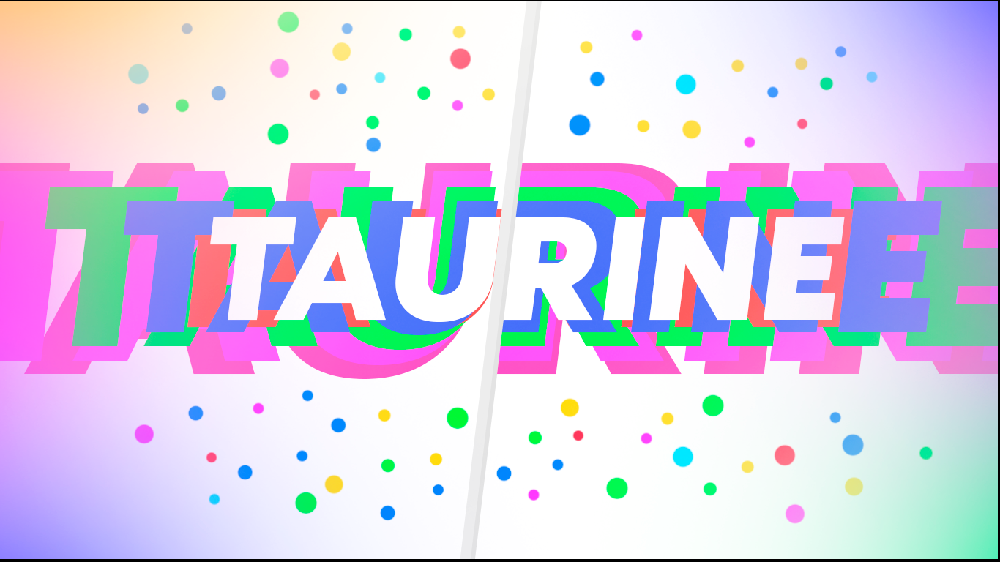

<h1 align="center">Taurine Project</h1>

Garden of language implementations written in C for [FreeKMS OS](https://github.com/by17s/KMS). Languages currently supported:
- [ ] Cesium: Lisp dialect
- [ ] Lunarity: Lua dialect

It also includes a variety of useful C libraries like [arty](./arty), [apple map](./apple_map) etc. for language development.
